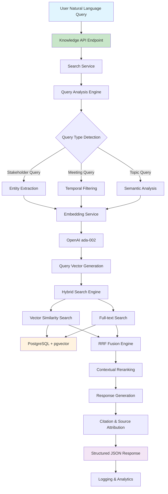
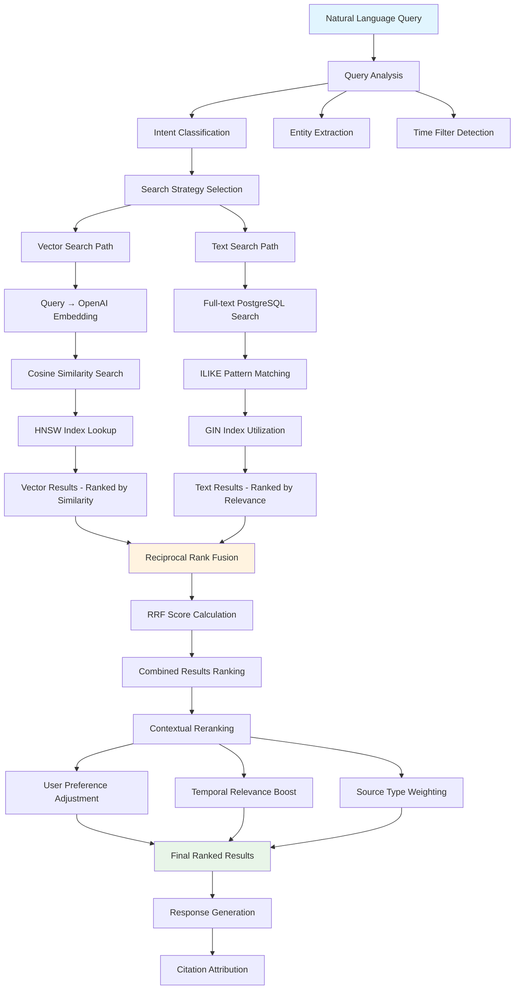
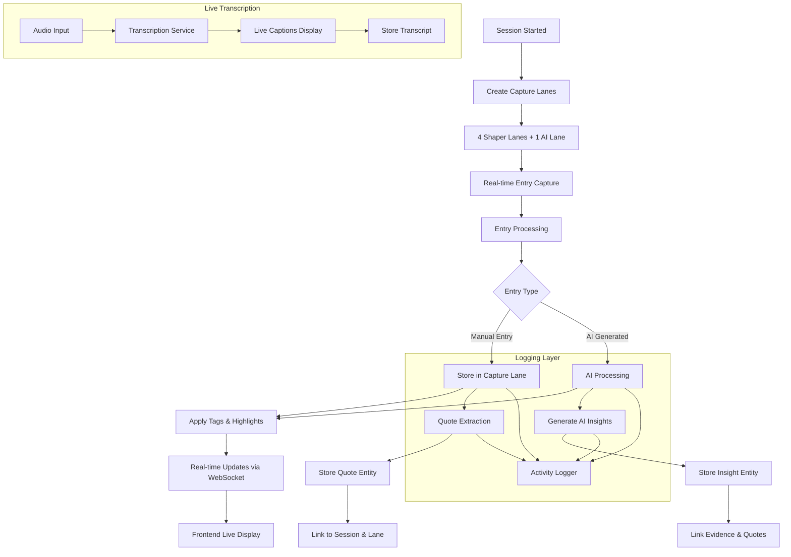
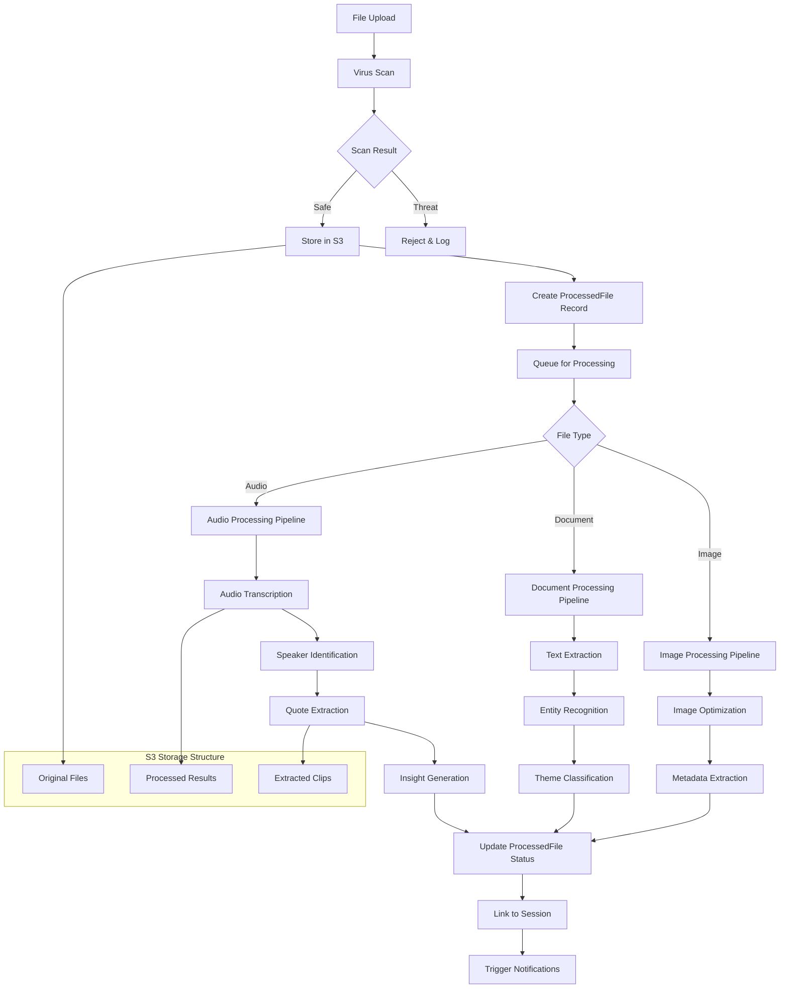
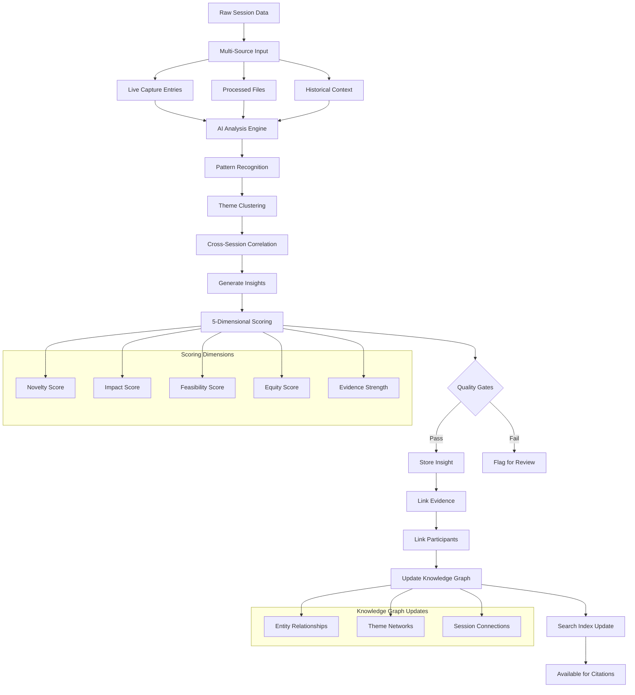
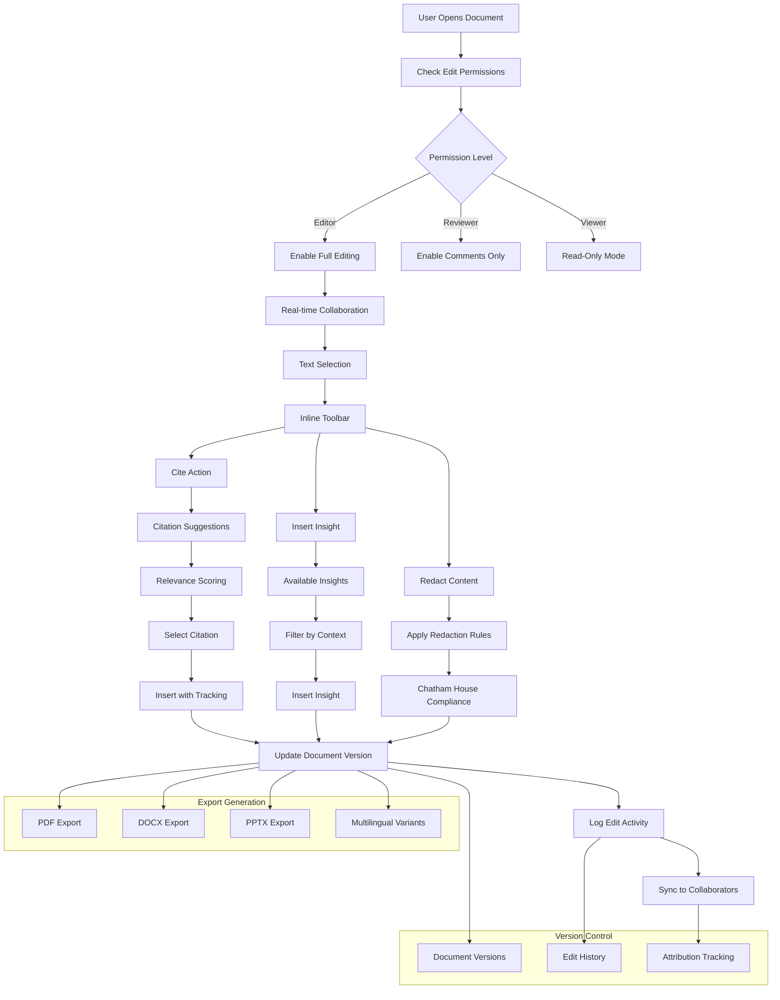
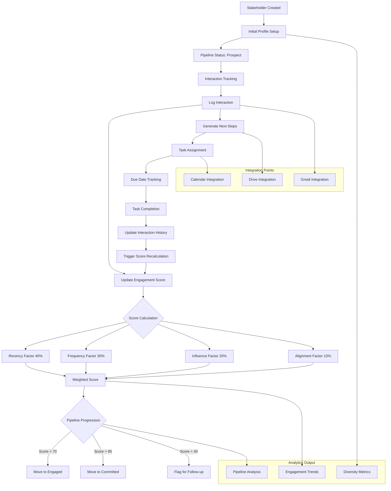
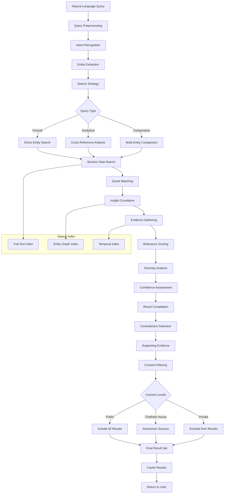
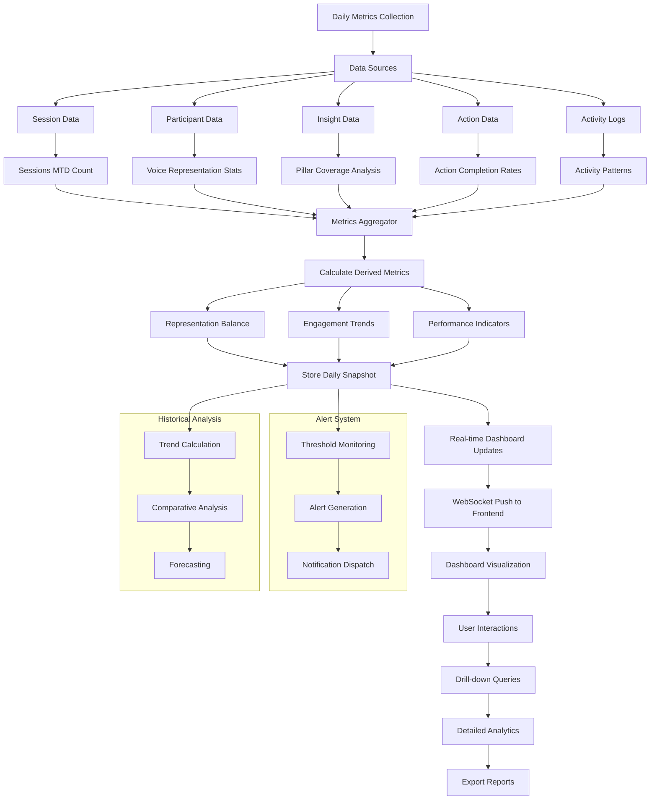

# YSI Catalyst: Data Flow Diagrams and Relationships

**Document Version**: 2.0  
**Date**: 2025-09-09  
**Author**: Claude (AI Assistant)  
**Implementation Status**: 🟢 **MVP RAG IMPLEMENTADO** ✅

## 🎉 RAG System Integration Status

### ✅ **COMPLETADO** - RAG Data Flows
- 🟢 **Vector Embeddings**: TextEmbedding model con pgvector
- 🟢 **Hybrid Search**: Vector + Full-text + RRF fusion  
- 🟢 **Natural Language Processing**: Query analysis y contextual understanding
- 🟢 **Data Ingestion**: Pipeline automatizado para transcripciones
- 🟢 **Knowledge API**: Endpoints completos para consultas RAG

**🚀 UPDATE**: Todos los diagramas han sido actualizados para incluir el flujo completo del sistema RAG implementado.  

---

## 🧠 RAG System Data Flow (IMPLEMENTADO ✅)

### RAG Architecture Overview



### Text Embedding Pipeline (IMPLEMENTADO ✅)

```mermaid
graph LR
    A[Raw Transcript Files] --> B[Data Ingestion Service]
    B --> C{File Type Detection}
    
    C -->|.txt| D[Plain Text Parser]
    C -->|.json| E[Structured Data Parser]
    C -->|.csv| F[Tabular Data Parser]
    
    D --> G[Text Normalization]
    E --> G
    F --> G
    
    G --> H[Intelligent Chunking]
    H --> I[1000 tokens + 100 overlap]
    
    I --> J[SHA256 Hash Generation]
    J --> K[Duplicate Detection]
    
    K -->|New Content| L[OpenAI Embedding API]
    K -->|Duplicate| M[Skip Processing]
    
    L --> N[Vector Generation - 1536 dims]
    N --> O[TextEmbedding Model]
    O --> P[PostgreSQL + pgvector]
    
    P --> Q[HNSW Index Creation]
    Q --> R[Metadata Indexing]
    R --> S[Performance Optimization]
    
    style A fill:#e3f2fd
    style L fill:#fff8e1  
    style P fill:#e8f5e8
```



### Hybrid Search Flow (IMPLEMENTADO ✅)



---

## Entity Relationship Overview

### Core Entities and Their Relationships

```mermaid
erDiagram
    USER ||--o{ SESSION : creates
    USER ||--o{ CAPTURE_LANE : assigned_to
    USER ||--o{ INSIGHT : creates
    USER ||--o{ CHARTER_DOCUMENT : edits
    USER ||--o{ PARTICIPANT : owns
    USER ||--o{ TEXT_EMBEDDING : processes
    USER ||--o{ KNOWLEDGE_QUERY : performs
    
    SESSION ||--o{ CAPTURE_LANE : contains
    SESSION ||--o{ PARTICIPANT : has
    SESSION ||--o{ QUOTE : generates
    SESSION ||--o{ INSIGHT : produces
    SESSION ||--o{ ACTION : spawns
    SESSION ||--o{ PROCESSED_FILE : processes
    SESSION ||--o{ TEXT_EMBEDDING : generates
    
    CAPTURE_LANE ||--o{ QUOTE : captures
    
    QUOTE }o--|| THEME : categorized_by
    QUOTE }o--|| SESSION : belongs_to
    QUOTE }o--|| CAPTURE_LANE : created_in
    QUOTE ||--o{ TEXT_EMBEDDING : vectorized_as
    
    INSIGHT }o--|| SESSION : derived_from
    INSIGHT }o--|| THEME : classified_as
    INSIGHT ||--o{ CITATION : cited_in
    INSIGHT ||--o{ TEXT_EMBEDDING : vectorized_as
    
    PARTICIPANT ||--o{ INTERACTION : has
    PARTICIPANT ||--o{ NEXT_STEP : assigned
    PARTICIPANT }o--|| ORGANIZATION : belongs_to
    
    INTERACTION ||--o{ NEXT_STEP : generates
    INTERACTION ||--o{ TEXT_EMBEDDING : vectorized_as
    
    CHARTER_DOCUMENT ||--o{ CITATION : contains
    
    CITATION }o--|| QUOTE : references
    CITATION }o--|| INSIGHT : references
    CITATION }o--|| SESSION : references
    CITATION }o--|| TEXT_EMBEDDING : found_via
    
    ACTION }o--|| SESSION : from
    ACTION }o--|| INSIGHT : triggered_by
    ACTION }o--|| INTERACTION : follows
    
    TEXT_EMBEDDING {
        int id PK
        string content_hash UK "SHA256 for deduplication"
        string source_type "meeting_transcript, insight, etc"
        int source_id "Reference to original entity"
        vector embedding "1536 dimensions - OpenAI ada-002"
        json metadata "Filters and context"
        int token_count "Cost tracking"
        timestamp created_at
    }
    
    KNOWLEDGE_QUERY {
        int id PK
        int user_id FK
        string query_text
        string search_mode "hybrid, vector, text, semantic"
        int result_count
        int processing_time_ms
        json query_analysis "Intent, entities, filters"
        timestamp created_at
    }
    
    KNOWLEDGE_QUERY }o--|| USER : performed_by
    KNOWLEDGE_QUERY ||--o{ TEXT_EMBEDDING : searches
    ACTION }o--|| PARTICIPANT : assigned_to
    
    PROCESSED_FILE }o--|| SESSION : belongs_to
    
    ACTIVITY_LOG }o--|| USER : performed_by
    ACTIVITY_LOG }o--|| SESSION : relates_to
    
    KNOWLEDGE_QUERY }o--|| USER : executed_by
    
    METRICS_SNAPSHOT : daily_aggregates
```

## Data Flow Diagrams

### 1. Live Session Capture Flow



### 2. File Processing Pipeline



### 3. Insight Generation and Knowledge Graph



### 4. Charter Document Collaboration Flow



### 5. Stakeholder CRM Data Flow



### 6. Knowledge Base Query Processing



### 7. Dashboard Metrics Aggregation Flow



## Cross-Component Data Dependencies

### Component Interaction Matrix

| Component | Depends On | Provides To | Data Shared |
|-----------|------------|-------------|-------------|
| **Dashboard** | Sessions, Insights, Actions, Participants | Frontend Display | Aggregated metrics, activity feed |
| **LiveCapture** | Sessions, Users, AI Service | Insights, Quotes | Real-time entries, transcriptions |
| **Insights** | Sessions, Quotes, Participants, AI Service | CharterBuilder, KnowledgeBase | Scored insights, evidence links |
| **CharterBuilder** | Insights, Quotes, Sessions, Users | Export Services | Citations, document versions |
| **StakeholderCRM** | Participants, Sessions, Actions | Analytics, Reporting | Interaction history, engagement scores |
| **KnowledgeBase** | All Components | Search Results | Cross-referenced data, contradictions |
| **ManualCapture** | Sessions, AI Service | Quotes, Insights | Processed content, extracted entities |

### Data Flow Priorities

#### Real-time Data Flows (< 100ms latency)
1. **LiveCapture** → **Frontend Dashboard** (activity feed updates)
2. **LiveCapture** → **WebSocket Clients** (real-time collaboration)
3. **Transcription** → **LiveCapture** (live captions)
4. **AI Processing** → **LiveCapture** (AI lane updates)

#### Near Real-time Data Flows (< 5 seconds)
1. **Quote Extraction** → **Knowledge Base Index**
2. **Insight Generation** → **Citation Suggestions**
3. **Engagement Score Updates** → **CRM Dashboard**
4. **Activity Logging** → **Security Monitoring**

#### Batch Processing Flows (minutes to hours)
1. **File Processing** → **Content Extraction**
2. **Daily Metrics** → **Snapshot Generation**
3. **Cross-session Analysis** → **Theme Clustering**
4. **Export Generation** → **Document Creation**

## Data Consistency and Integrity

### Transaction Boundaries

#### Session-Scoped Transactions
- Creating session with initial participants
- Live capture entry with quote extraction
- Session completion with summary generation

#### Document-Scoped Transactions
- Charter editing with version control
- Citation insertion with evidence linking
- Export generation with consent verification

#### Stakeholder-Scoped Transactions
- Interaction logging with score updates
- Pipeline status changes with history
- Next step creation with notifications

### Data Validation Rules

#### Input Validation
```python
# Session creation validation
def validate_session_creation(session_data):
    required_fields = ["title", "facilitator_id", "created_by_id"]
    consent_rules = validate_consent_settings(session_data.get("consent"))
    participant_limits = validate_participant_count(session_data.get("participants"))
    return all([required_fields_check, consent_rules, participant_limits])

# Quote validation
def validate_quote(quote_data):
    content_check = len(quote_data.get("content", "")) > 10
    speaker_check = quote_data.get("speaker") is not None
    consent_check = quote_data.get("consent_status") in ["public", "chatham-house", "private"]
    return all([content_check, speaker_check, consent_check])

# Insight scoring validation
def validate_insight_scores(scores):
    required_dimensions = ["novelty", "impact", "feasibility", "equity", "evidence"]
    score_range_valid = all(0 <= scores.get(dim, -1) <= 100 for dim in required_dimensions)
    return len(scores) == len(required_dimensions) and score_range_valid
```

#### Referential Integrity
```sql
-- Foreign key constraints ensure referential integrity
ALTER TABLE quotes ADD CONSTRAINT fk_quotes_session 
    FOREIGN KEY (session_id) REFERENCES sessions(id) ON DELETE CASCADE;

ALTER TABLE citations ADD CONSTRAINT fk_citations_document 
    FOREIGN KEY (document_id) REFERENCES charter_documents(id) ON DELETE CASCADE;

ALTER TABLE interactions ADD CONSTRAINT fk_interactions_stakeholder 
    FOREIGN KEY (stakeholder_id) REFERENCES participants(id) ON DELETE CASCADE;

-- Check constraints ensure data validity
ALTER TABLE insights ADD CONSTRAINT chk_novelty_score 
    CHECK (novelty_score >= 0 AND novelty_score <= 100);

ALTER TABLE participants ADD CONSTRAINT chk_engagement_score 
    CHECK (engagement_score >= 0 AND engagement_score <= 100);

ALTER TABLE quotes ADD CONSTRAINT chk_consent_status 
    CHECK (consent_status IN ('public', 'chatham-house', 'private'));
```

## Performance Optimization Strategies

### Database Query Optimization
```sql
-- Indexes for frequent queries
CREATE INDEX idx_sessions_date_status ON sessions(created_at, status);
CREATE INDEX idx_quotes_session_pillar ON quotes(session_id, pillar);
CREATE INDEX idx_insights_theme_scores ON insights(theme_id, impact_score, novelty_score);
CREATE INDEX idx_participants_engagement ON participants(engagement_score DESC, pipeline_status);

-- Materialized views for complex aggregations
CREATE MATERIALIZED VIEW daily_session_metrics AS
SELECT 
    DATE(created_at) as metric_date,
    COUNT(*) as session_count,
    COUNT(DISTINCT facilitator_id) as unique_facilitators,
    AVG(duration_minutes) as avg_duration
FROM sessions 
WHERE status = 'completed'
GROUP BY DATE(created_at);

-- Refresh materialized view daily
REFRESH MATERIALIZED VIEW daily_session_metrics;
```

### Caching Strategy
```python
# Redis caching for frequently accessed data
class CacheService:
    def __init__(self):
        self.redis_client = redis.Redis(host='localhost', port=6379, db=0)
    
    def cache_dashboard_metrics(self, metrics_data):
        key = f"dashboard:metrics:{datetime.now().strftime('%Y-%m-%d')}"
        self.redis_client.setex(key, 3600, json.dumps(metrics_data))  # 1 hour TTL
    
    def cache_session_insights(self, session_id, insights):
        key = f"session:{session_id}:insights"
        self.redis_client.setex(key, 1800, json.dumps(insights))  # 30 minutes TTL
    
    def cache_knowledge_query(self, query_hash, results):
        key = f"knowledge:query:{query_hash}"
        self.redis_client.setex(key, 7200, json.dumps(results))  # 2 hours TTL
```

This comprehensive data flow documentation ensures that all components of the YSI Catalyst platform work together seamlessly while maintaining data integrity, performance, and security.